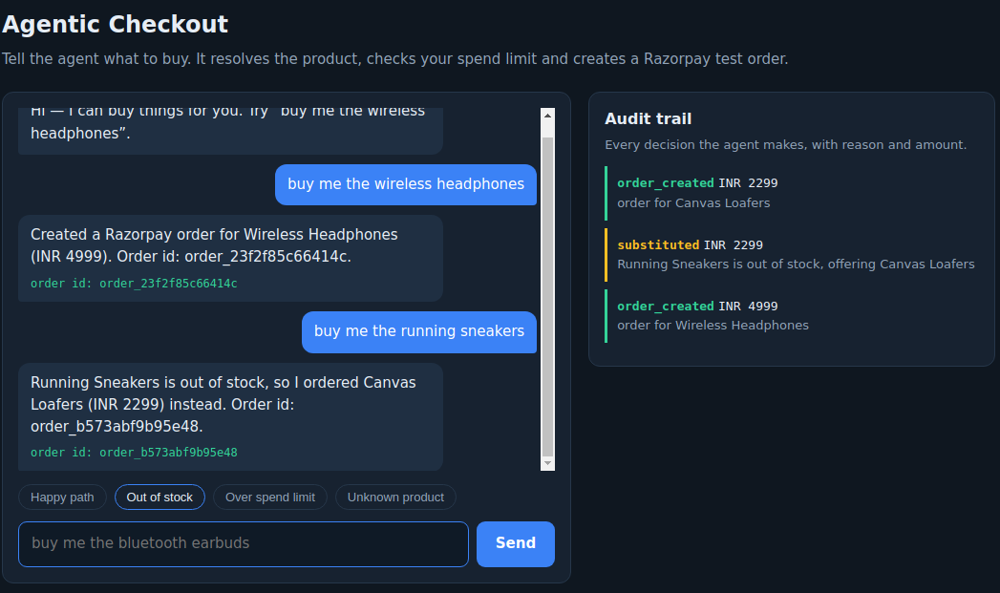
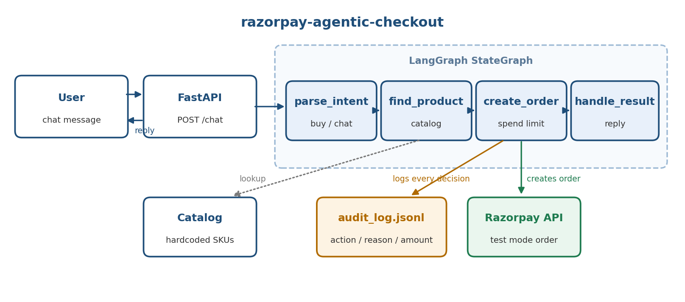

# razorpay-agentic-checkout

A chat agent that can actually buy things — usable by a person or by another AI.
You tell it what you want, a LangGraph agent discovers the product in the
merchant catalog, substitutes when it is out of stock, checks a spend limit, and
creates a Razorpay (test-mode) order — recording every decision in an audit trail.

Demo video: _TODO — https://drive.google.com/file/d/13XgrKLjs0J7jCHhV8ATYs8C8ifFIY7OA/view?usp=sharing





## How it works

`POST /chat` runs a four-node LangGraph state machine:

| Node | Responsibility |
| --- | --- |
| `parse_intent` | Is the user trying to buy something, or just chatting? |
| `find_product` | Resolve the message against the catalog; substitute if out of stock |
| `create_order` | Enforce the spend limit, then create a Razorpay order |
| `handle_result` | Confirm the order, or explain the refusal gracefully |

Guardrails: purchases above `SPEND_LIMIT_INR` are refused before any call to
Razorpay, and every decision (`substituted`, `order_created`, `order_blocked`,
`order_failed`, ...) is recorded with a reason, amount and timestamp — kept in
memory (`GET /audit`) and appended to `audit_log.jsonl`.

Failure paths the agent handles: out of stock (offers the cheapest in-stock item
in the same category, or apologizes), over the spend limit, unknown product, and
a payment provider error.

## Setup

Requires Python 3.9+.

```bash
python3 -m venv .venv && source .venv/bin/activate   # Windows: .venv\Scripts\activate
pip install -r requirements.txt
cp .env.example .env   # add your Razorpay test keys
uvicorn app.main:app --reload
```

Then open <http://localhost:8000> for the chat UI — a single static page (no build
step) with one-click buttons for each demo path and a live audit-trail panel.

## Usage

```bash
curl -s localhost:8000/chat -H 'content-type: application/json' \
  -d '{"message": "buy me the wireless headphones"}'
```

| Route | Purpose |
| --- | --- |
| `GET /` | Chat UI |
| `POST /chat` | Send a message to the agent |
| `GET /audit` | In-memory audit trail |

See [demo/demo_script.md](demo/demo_script.md) for the full walkthrough,
including the blocked-purchase and unknown-product paths.

## Configuration

| Variable | Description |
| --- | --- |
| `RAZORPAY_KEY_ID` | Razorpay test-mode key id |
| `RAZORPAY_KEY_SECRET` | Razorpay test-mode key secret |
| `SPEND_LIMIT_INR` | Per-order spend cap, default `5000` |
| `AUDIT_LOG_PATH` | Audit trail file, default `audit_log.jsonl` |
